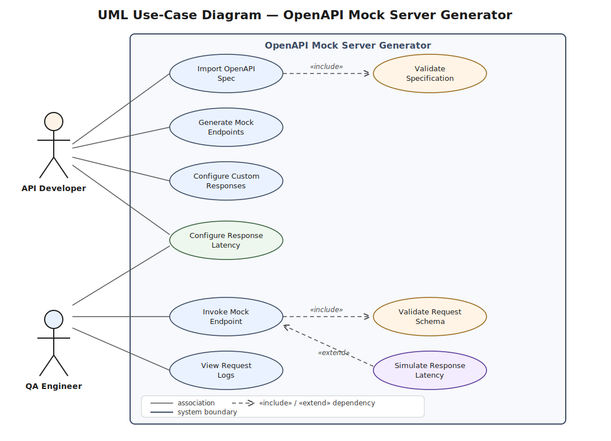
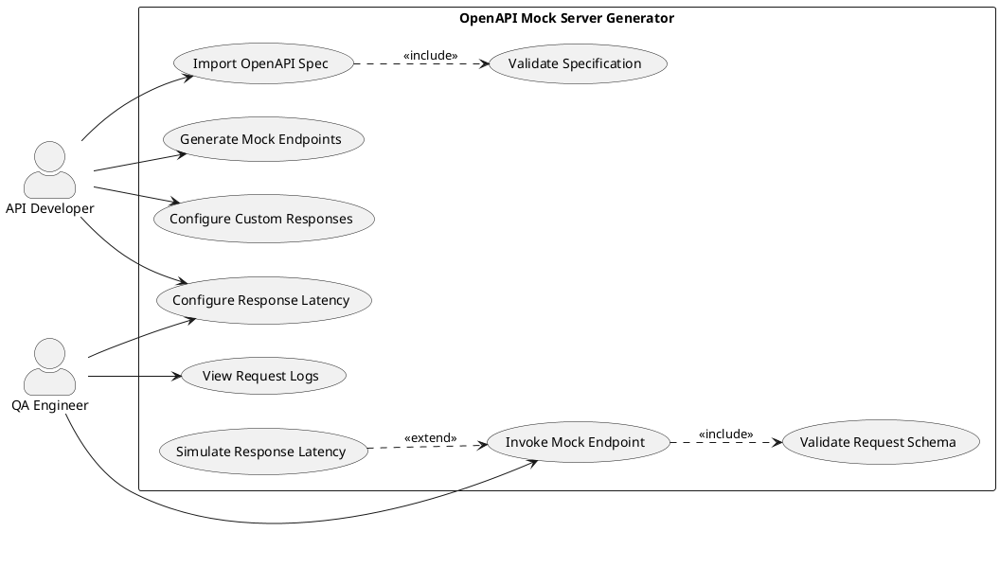

# UML Use-Case Diagram

**Project:** OpenAPI Mock Server Generator

> The vector source is available at [`diagrams/use-case-diagram.svg`](diagrams/use-case-diagram.svg).

## Actors
| Actor | Role |
|---|---|
| **API Developer** | Imports specifications, generates the mock server, and configures endpoint behaviour. |
| **QA Engineer** | Exercises the generated mock endpoints during testing and inspects request logs. |

## Use Cases
| Use Case | Actor(s) | Related Requirement |
|---|---|---|
| Import OpenAPI Spec | API Developer | FR-001 |
| Generate Mock Endpoints | API Developer | FR-002 |
| Configure Custom Responses | API Developer | FR-005 |
| Configure Response Latency | API Developer, QA Engineer | FR-004 |
| Invoke Mock Endpoint | QA Engineer | FR-002 / FR-003 |
| View Request Logs | QA Engineer | FR-003 |
| Validate Specification | *(included)* | FR-001 |
| Validate Request Schema | *(included)* | FR-003 |
| Simulate Response Latency | *(extension)* | FR-004 |

## Relationships
- **`«include»`** — *Import OpenAPI Spec* **includes** *Validate Specification*. Validation is an
  unconditional, mandatory sub-step of every import, so it is factored out as an included use case.
- **`«include»`** — *Invoke Mock Endpoint* **includes** *Validate Request Schema*. Every incoming
  request is validated against the schema, so this behaviour is always executed as part of invocation.
- **`«extend»`** — *Simulate Response Latency* **extends** *Invoke Mock Endpoint*. Latency simulation
  is applied **conditionally**, only when the user has configured a delay for that endpoint; the base
  use case is complete without it, which is exactly what an extension models.

---

## PlantUML Source (regenerable)

