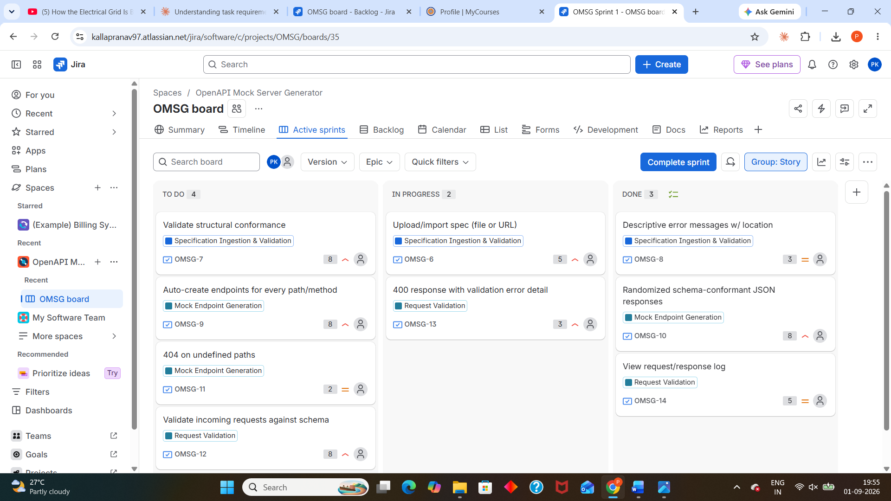
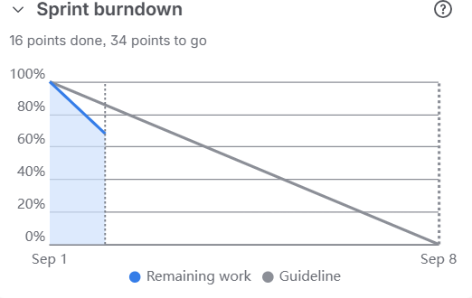
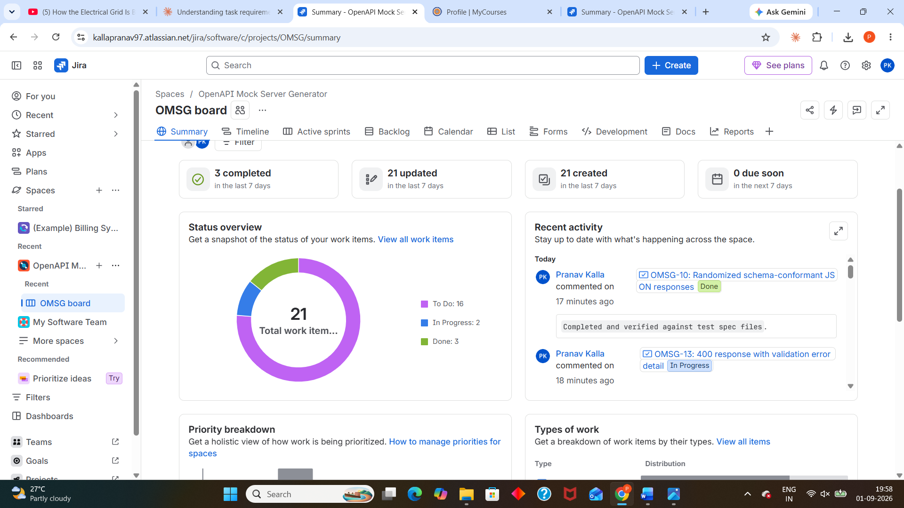
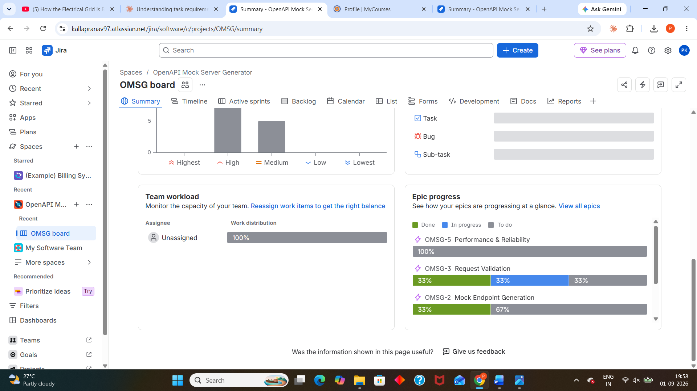
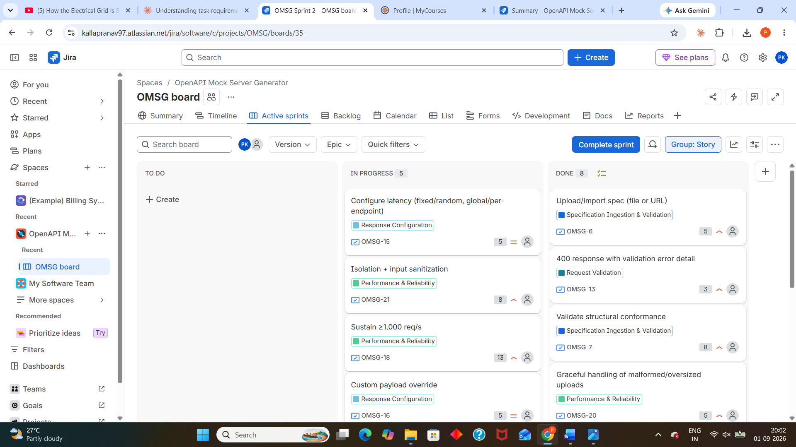
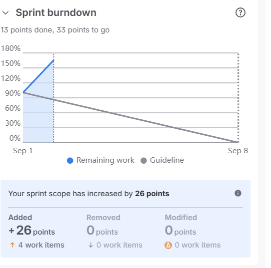
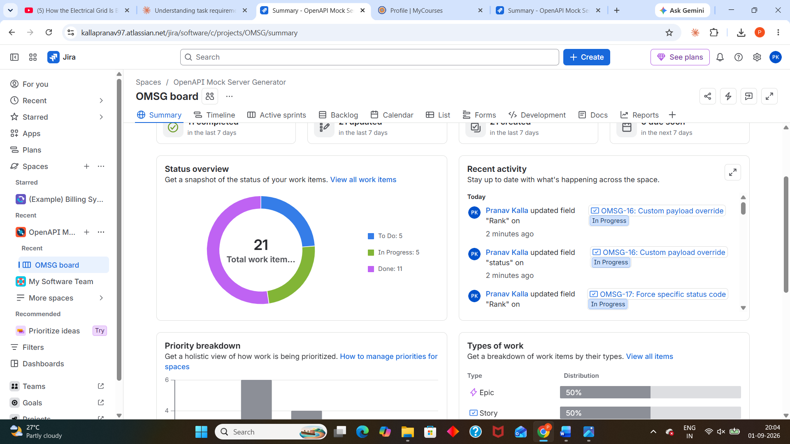

# Sprint Summary — OpenAPI Mock Server Generator (OMSG)

Two 1-week sprints were run to deliver the 16-story, 84-point backlog.

---

## Sprint 1 (Sep 1 – Sep 8)

**Scope:** Epics 1–3 (Specification Ingestion & Validation, Mock Endpoint
Generation, Request Validation) — the core ingestion-to-validation "walking
skeleton" of the system.

| Story | Points |
|---|---|
| OMSG-6 Upload/import spec | 5 |
| OMSG-7 Validate structural conformance | 8 |
| OMSG-8 Descriptive error messages | 3 |
| OMSG-9 Auto-create endpoints | 8 |
| OMSG-10 Randomized schema-conformant responses | 8 |
| OMSG-11 404 on undefined paths | 2 |
| OMSG-12 Validate incoming requests | 8 |
| OMSG-13 400 response with validation error detail | 3 |
| OMSG-14 View request/response log | 5 |
| **Sprint 1 total** | **50** |

Stories were progressed through **To Do → In Progress → Done** over the
sprint, with progress comments logged on each card as work advanced.

**Sprint 1 board (mid-sprint state):**

**Sprint 1 burndown chart:**

At the point captured, 16 of 50 points were complete, tracking close to the
ideal guideline.

**Space summary after Sprint 1:**

At sprint close, any incomplete Sprint 1 stories rolled forward into Sprint 2
per standard Scrum practice.

---

## Sprint 2 (Sep 1 – Sep 8)

**Scope:** Epics 4–5 (Response Configuration, Performance & Reliability) plus
carry-over work from Sprint 1.

| Story | Points |
|---|---|
| OMSG-15 Configure latency | 5 |
| OMSG-16 Custom payload override | 5 |
| OMSG-17 Force specific status code | 2 |
| OMSG-18 Sustain ≥1,000 req/s | 13 |
| OMSG-19 Latency accuracy ±10ms | 8 |
| OMSG-20 Graceful handling of malformed uploads | 5 |
| OMSG-21 Isolation + input sanitization | 8 |
| **New scope total** | **46** |

Because unfinished Sprint 1 items carried forward, Sprint 2's total scope
increased by 26 points (4 work items) over its initial plan — a realistic
reflection of estimation variance, which is discussed in the reflection
below.

**Sprint 2 board:**

**Sprint 2 burndown chart:**

At the point captured, 13 of 46 points were complete, with scope growth
clearly visible as the early spike in the burndown line.

**Space summary after Sprint 2:**

By the end of Sprint 2, 11 of 21 total work items were marked Done, with the
remainder split between In Progress and To Do.

---

## Reflection

Running the backlog across two sprints surfaced a few realistic Agile
lessons:

- **Scope carry-over is normal, not a failure.** Sprint 1's unfinished items
  rolling into Sprint 2 (visible as the scope-increase spike on the Sprint 2
  burndown) reflects how real teams handle incomplete work — it gets
  re-planned, not discarded.
- **High-uncertainty stories (e.g., OMSG-18 "Sustain ≥1,000 req/s", 13
  points) deserved their higher estimate** — performance and reliability
  work carries more inherent risk than straightforward CRUD-style stories,
  which the Fibonacci scale is designed to capture.
- **Grouping NFRs into their own Epic (Epic 5)** made it easier to track
  cross-cutting quality attributes separately from user-facing functionality,
  rather than losing them inside feature Epics.
- **Burndown guidelines are a signal, not a verdict** — tracking below or
  above the guideline line early in a sprint is useful for spotting
  estimation or capacity issues, but the real value came from the
  discussion it prompted about why scope shifted between sprints.
